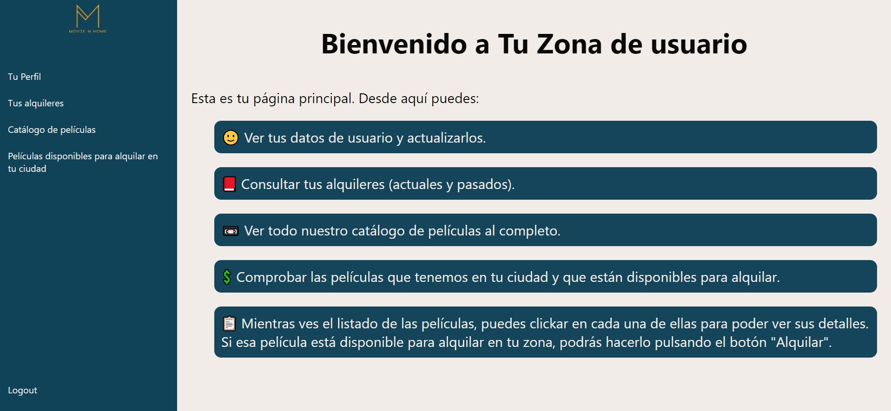

# Proyecto Frontend React
## Solicitan desde GeeksHubs Academy realizar un frontend para el proyecto de API realizado en el repositorio https://github.com/aramossanchez/Proyecto_VideoClub_API.
***

***
La aplicación se encuentra desplegada en AWS en el siguiente enlace: https://deploy.d33nwpnuidrsr6.amplifyapp.com/
<br>
La aplicación tiene las siguientes características:
* Los usuarios pueden logarse en la aplicación. Existen 2 tipos de usuarios, y cada perfil podrá realizar una serie de acciones:
    * Usuarios:
        * Ver su perfil. En su perfil pueden cambiar sus datos, guardados en la base de datos.
        * Ver los alquileres que ha realizado.
        * Ver el listado completo de las películas del videoclub.
        * Ver el listado de las películas disponibles para alquilar en la ciudad del usuario logado.
    * Administrador:
        * Crear usuario nuevo.
        * Buscar usuario por ID, cambiar los datos guardados de ese usuario, y borrar ese usuario de la base de datos.
        * Ver listado completo de los usuarios registrados en la base de datos. Clickando en cada uno de ellos, te redirige a la pantalla de buscar usuario por id, con su información ya cargada.
        * Crear película nueva.
        * Buscar película por ID, cambiar los datos guardados de esa película, y borrar esa película de la base de datos.
        * Ver listado completo de las películas del videoclub. Clickando en cada una de ellas, te redirige a la pantalla de buscar pelicula por id, con su información ya cargada.
        * Buscar pedido por ID, donde se pueden ver los datos del pedido, del usuario que hizo el alquiler y de la película que ha sido alquilada.
        * Ver listado completo de todos los pedidos realizados. Clickando en cada uno de ellos, te redirige a la pantalla de buscar pedido por id. También se pueden borrar los pedidos desde esta misma pantalla.
* Existe una opción de contacto, donde los usuarios podrán solicitar la creación de una cuenta, o mandar una pregunta o sugerencia.
***

***

***

## Pre-requisitos del proyecto para hacerlo funcionar en tu equipo local:

* Instalar **Nodejs** en nuestro equipo, descargándolo de su página oficial
https://nodejs.org/

* Clonar el proyecto en nuestro equipo con git bash:
```
$git clone 'url-del-repositorio'
```

* Instalar todas las dependecias con el siguiente comando:
```
npm install
```

* Arrancamos el servidor con el siguiente comando:
```
npm start
```

## Tecnologías utilizadas en el proyecto:

* **react**: Instalamos react en nuestro proyecto:
```
npm install react
```
* **react-router-dom**: Instalamos react-router-dom en nuestro proyecto, para poder alternar entre vistas en nuestra aplicación:
```
npm install react-router-dom
```
* **axios**: Instalamos axios en nuestro proyecto, para poder hacer consultas a la API:
```
npm install axios
```
* **redux**: Instalamos redux en nuestro proyecto, para poder usar redux (centralización del estado):
```
npm install redux
```
* **react-redux**: Instalamos react-redux en nuestro proyecto (relaciona react y redux):
```
npm install react-redux
```
* **sass**: Instalar sass en el proyecto (css mejorado, con nuevas funcionalidades)

## Explicación de la estructura del proyecto

El directorio **src** es donde está almacenada toda la aplicación. En este directorio se encuentra lo siguiente:

* **index.js**: Este es el archivo principal. Desde aquí se llama a **<App/>**, que es donde se ejecutará toda la aplicación.

* **app.js**: En este archivo es donde se gestionan los diferentes **Containers** de la aplicación (vistas).

* **Redux**: En este directorio guardamos toda la configuración de redux de la aplicación.
    * **store.js**: En este archivo se encuentra el estado general de la aplicación.
    * **types.js**: En este archivo se encuentran los nombres de los types que pasamos por action al reducer.
    * **reducers**: En este directorio se encuentran todos los reducers que modifican el estado:
        * **index.js**: En este archivo combinamos todos los reducers, para conseguir la centralización deseada de estados con redux.
        * **datosLogin-reducer.js**: En este archivo tenemos las funciones que editan el estado de redux para los types LOGIN, LOGOUT y ACTUALIZA_DATOS_LOGIN.
        * **idUsuarioBuscado-reducer.js**: En este archivo se encuentran la función que editan el estado de redux para el type GUARDAR_ID_USUARIO. Guarda en redux el id del usuario que se clicka en el listado de usuarios.
        * **idPeliculaBuscada-reducer.js**: En este archivo se encuentra la función que editan el estado de redux para el type GUARDAR_ID_PELICULA. Guarda en redux el id de la película que se clicka en el listado de películas.
        * **idPedidoBuscada-reducer.js**: En este archivo se encuentra la función que editan el estado de redux para el type GUARDAR_ID_PEDIDO. Guarda en redux el id del pedido que se clicka en el listado de pedidos.
        * **controlarMensajeAlquiler-reducer.js**: En este archivo se encuentran las funciones que editan el estado de redux para los types MENSAJE_ALQUILAR y PELICULA_ALQUILADA. Guarda la película que será alquilada, y guarda si se debe de mostrar o no el mensaje de alquilar película.
        * **datosActualizarUsuario-reducer.js**: En este archivo tenemos las funciones que editan el estado de redux para los types COPIA_DATOS_LOGIN y GUARDA_CAMBIOS_ACTUALIZAR.
        * **peliculasMostradas-reducerr.js**: En este archivo se encuentra la función que editan el estado de redux para el type GUARDAR_PELICULAS. Guarda en redux el listado películas buscado, y también el filtrado que se hace en las barras de búsqueda

* **Containers**: En este directorio es donde se guardarán las diferentes vistas:
    * **Alquileres**: En esta vista se ve el listado de alquileres del usuario logado.
    * **BuscarPedido**: En esta vista se busca un pedido por id, y se muestra la información del pedido, del usuario que ha realizado el pedido y la película alquilada.
    * **BuscarPelicula**: En esta vista se busca una película por id. Además, se puede editar la información guardada de la película y borrar la película.
    * **BuscarUsuario**: En esta vista se busca un usuario por id. Además, se puede editar la información guardada del usuario y borrar el usuario.
    * **Contacto**: En esta vista se contacta con el administrador por correo electronico, rellenando cualquiera de los dos formularios disponibles.
    * **Inicio**: En esta vista se puede realizar el login, y acceder a la vista de contacto.
    * **ListadoPedidos**: En esta vista se visualizan los pedidos realizados, y se puede acceder a la busqueda esos pedidos clickando en cualquiera de ellos. También se pueden borrar pulsando el botón correspondiente.
    * **ListadoPeliculas**: En esta vista se visualizan las películas del videoclub, y se puede acceder a la búsqueda de las películas clickando en cualquiera de ellas.
    * **ListadoUsuarios**: En esta vista se visualizan los usuarios del videoclub, y se puede acceder a la búsqueda de los usuarios clickando en cualquiera de ellos.
    * **PantallaError**: En esta vista se muestra la pantalla de error que aparece al intentar acceder a zonas de la aplicación sin estar logado.
    * **Peliculas**: En esta vista se muestra todo el listado de películas de la aplicación. Se puede hacer filtrado por título, género y protagonista. Se puede acceder al detalle de cada película clickando sobre ella.
    * **PeliculasDisponibles**: En esta vista se muestran todas las películas sin alquilar que están en la ciudad del usuario logado.
    * **Perfil**: En esta vista se muestran los datos del usuario logado. Se pueden modificar esos datos.
    * **PerfilPelicula**: En esta vista se muestra todo los datos de la película. Si la película está sin alquilar y está en la misma ciudad que el usuario logado, aparece disponible la opción de alquilar.
    * **RegistroPeliculas**: En esta vista se pueden crear películas nuevas.
    * **RegistroUsuarios**: En esta vista se pueden crear usuarios nuevos.
    * **TuZona**: En esta vista se muestra un resumen de lo que puede hacer cada perfil de usuario en la aplicación.

* **Components**: En este directorio es donde se guardan todos los componentes que se usarán en todas las vistas:
    * **AlquilerPelicula**: Es el menú que aparece al intentar alquilar una película.
    * **Lateral**: Es el menú que aparece en la parte lateral de la aplicación cuando nos logamos.
* **img**: En este directorio se guardan todas las imágenes que se usarán en la aplicación.
* **style**: En este directorio se guarda el archivo **colors.scss**, donde se guardan las variables de color que usará toda la aplicación.
* **screenshots**: En este directorio se guardan las imágenes que aparecen en el readme de github.